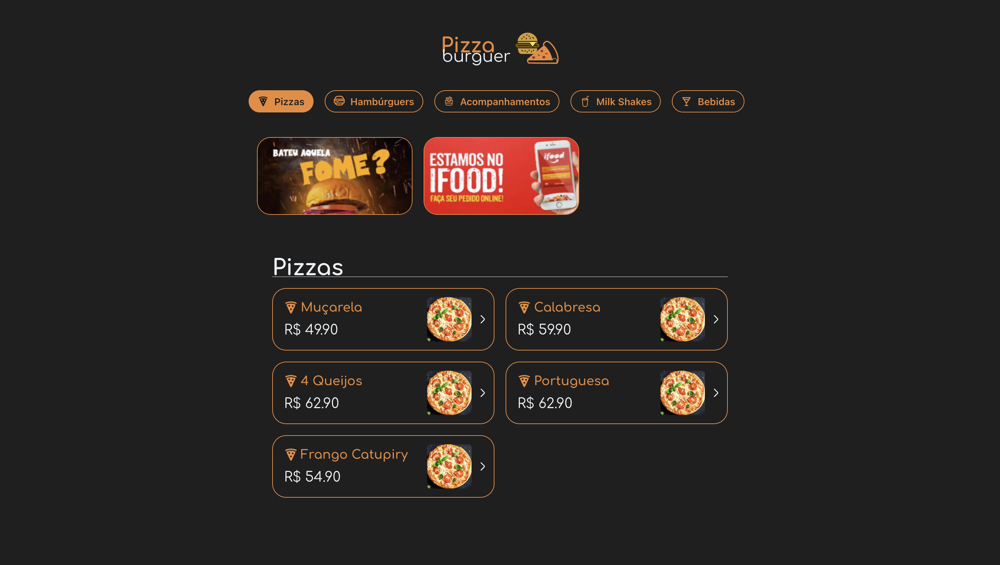

# Pizza Burguer

This project is a online menu for a imaginary restaurant named Pizza Burguer

## Live Application

```
https://pizza-burguer.ispapps.com
```

## Preview



## Used Technologies

- React
- Chakra UI
- React Router
- UUID
- Numeral

## Main Concepts Applied

- JSX
- React Hooks
- List Items
- Dynamic Routes
- Atomic Design
- Mobile Responsive

## Requirements to Run

- Node [nodejs.org](https://nodejs.org/en)

## Getting Started

1. Clone the repo:

```
git clone https://github.com/IgorSprovieri/pizza-burguer
```

2. Install dependencies:

```
cd pizza-burguer
npm install
```

4. Run the project:

```
npm run start
```

## Author


### _Igor Sprovieri_

---

Programmer since 2013, I started to work professionaly in 2020, developing games with Unity, where I opened my game studio and until 2022 I developed 16 team projects, copyright and third-party. I was also a writer for more than a year on the website crieseusjogos.com.br. After this period I started to dedicate to web development and today I work as a fulltack developer with react, next, typescript and node.
